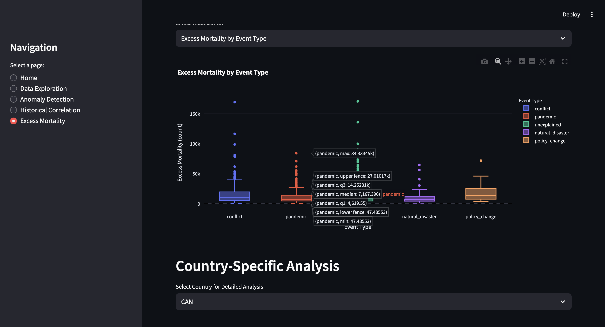

### Mortality Analysis Dashboard

A comprehensive data science project for analyzing mortality data across different countries and time periods. This repository contains both the original Jupyter notebook with detailed data analysis and an interactive Streamlit web application for exploring mortality patterns, detecting anomalies, correlating them with historical events, and calculating excess mortality statistics.

## 📊 Screenshots

### Streamlit Dashboard - Home Page


### Data Exploration


### Anomaly Detection


### Historical Correlation


### Excess Mortality



## 🌟 Features

### Jupyter Notebook Analysis

- **Exploratory Data Analysis (EDA)**: Comprehensive statistical analysis of mortality data
- **Data Preprocessing**: Data cleaning, transformation, and preparation
- **Statistical Modeling**: Implementation of anomaly detection algorithms
- **Visualization**: Detailed plots and charts for data insights
- **Research Documentation**: Step-by-step analysis with explanations


### Interactive Streamlit Dashboard

- **Data Exploration**: Analyze mortality data by country, year, and demographic factors
- **Anomaly Detection**: Identify unusual mortality patterns using statistical methods:

- Z-Score method
- IQR (Interquartile Range) method
- Moving Average method


- **Historical Correlation**: Correlate mortality anomalies with historical events:

- Pandemics
- Conflicts
- Natural disasters
- Policy changes
- Heat waves


- **Excess Mortality**: Calculate and visualize excess mortality during anomalous periods
- **Interactive Visualizations**: Dynamic charts and plots with user controls
- **Data Export**: Download filtered data and analysis results


## 🔧 Installation

1. Clone this repository:

```shellscript
git clone https://github.com/smangukia/Mortality-Rate-Analysis.git
cd Mortality-Rate-Analysis
```


2. Create a virtual environment (optional but recommended):

```shellscript
python -m venv venv
source venv/bin/activate  # On Windows: venv\Scripts\activate
```


3. Install the required packages:

```shellscript
pip install -r requirements.txt
```


## 🚀 Usage

### Running the Jupyter Notebook

1. Start Jupyter Notebook:

```shellscript
jupyter notebook
```


2. Open `mortality_analysis.ipynb` in your browser
3. Run the cells sequentially to reproduce the analysis


### Running the Streamlit Dashboard

1. Run the Streamlit app:

```shellscript
streamlit run app.py
```

2. Open your browser and navigate to the URL displayed in the terminal (typically [http://localhost:8501](http://localhost:8501))
3. Navigate through the different pages using the sidebar:

1. Home
2. Data Exploration
3. Anomaly Detection
4. Historical Correlation
5. Excess Mortality


4. Adjust parameters using the interactive controls and explore visualizations


## 📊 Data

The application uses mortality data with the following structure:

- Country
- Year
- Sex
- Total mortality
- Age-specific mortality columns (d0, d1, d5, etc.)


If the original data file is not found, the application will create sample data for demonstration purposes.

## 🔍 Methods

### Anomaly Detection

The project implements three methods for anomaly detection:

1. **Z-Score**: Identifies data points that deviate significantly from the mean
2. **IQR (Interquartile Range)**: Identifies outliers based on the interquartile range
3. **Moving Average**: Identifies points that deviate from the local trend


### Excess Mortality Calculation

Excess mortality is calculated by:

1. Computing the expected mortality based on previous years
2. Calculating the difference between actual and expected mortality
3. Determining statistical significance using confidence intervals


### Historical Correlation

The analysis matches detected anomalies with a database of historical events, including:

- Pandemics (1968 Hong Kong Flu, 2009 H1N1, 2020 COVID-19, etc.)
- Conflicts (Gulf War, 9/11, various regional conflicts)
- Natural disasters (earthquakes, tsunamis, hurricanes)
- Policy changes (healthcare reforms, reunifications)
- Heat waves and climate events


## 💻 Technologies Used

- **Python**: Core programming language
- **Jupyter Notebook**: Interactive development environment for analysis
- **Streamlit**: Web application framework
- **Pandas**: Data manipulation and analysis
- **NumPy**: Numerical computing
- **Matplotlib & Seaborn**: Static data visualization
- **Plotly**: Interactive data visualization
- **SciPy**: Scientific computing and statistical analysis


## 🔮 Future Improvements

- Add geographic visualizations with maps
- Implement machine learning models for mortality prediction
- Add demographic breakdowns for more detailed analysis
- Implement report generation functionality
- Add data upload functionality for custom datasets
- Integrate real-time data sources
- Add more sophisticated time series analysis methods


## 📄 License

This project is licensed under the MIT License - see the [LICENSE](LICENSE) file for details.

## 🤝 Contributing

Contributions are welcome! Please feel free to submit a Pull Request.

1. Fork the repository
2. Create your feature branch (`git checkout -b feature/amazing-feature`)
3. Commit your changes (`git commit -m 'Add some amazing feature'`)
4. Push to the branch (`git push origin feature/amazing-feature`)
5. Open a Pull Request


## 📈 Project Workflow

1. **Data Analysis** (`mortality_analysis.ipynb`): Start here to understand the data and methodology
2. **Web Application** (`app.py`): Interactive dashboard for exploring results and conducting further analysis
3. **Deployment**: The Streamlit app can be deployed on various platforms (Streamlit Cloud, Heroku, etc.)


**Note**: This project demonstrates the complete data science workflow from research and exploratory analysis in Jupyter notebooks to developing an interactive web application that can be run locally or deployed to cloud platforms.
